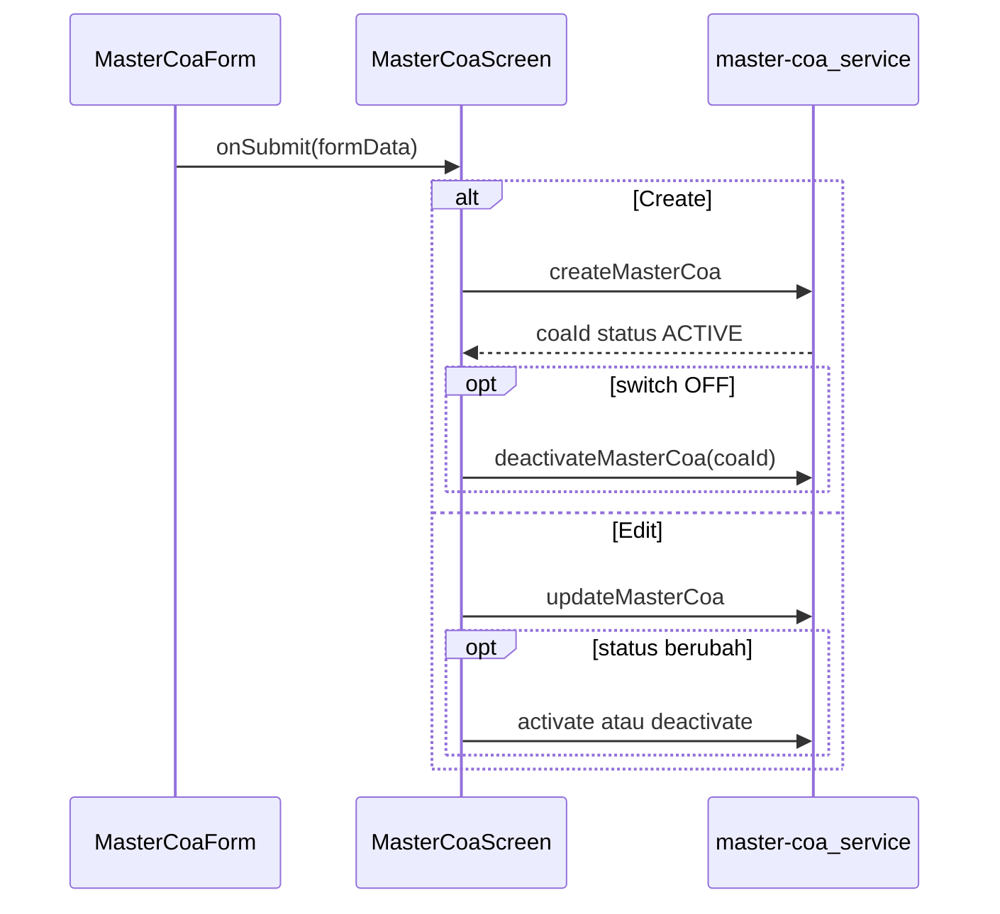

# Rencana: Perbaikan Form Tambah/Edit Master COA

## Konteks

| Aspek | Sebelum | Sasaran |
|--------|---------|---------|
| Jenis Transaksi | Manual loop dengan `fields.map()` (line 158-232) | `DataTable` dengan inline editing (pola [`DataTransaksiTab.tsx`](../../src/modules/fjb/components/tabs/DataTransaksiTab.tsx)) |
| Anggota | Checkbox statis (`BranchCheckboxGroup` + `BRANCH_OPTIONS`) | `SelectField` `mode="multi"` + `Controller` ✅ |
| Status | Hanya lewat aksi list/detail | `Switch` + `Controller` ✅ |

## Catatan API

Lihat [`master_coa_update.api.md`](./master_coa_update.api.md): `POST` / `PUT` tidak membawa field `status`; create default `ACTIVE`; perubahan status lewat `PATCH .../activate` dan `PATCH .../deactivate`.

Alur submit:

'
## Status Implementasi

| No | Fitur | Status | Keterangan |
|----|-------|--------|---------|
| 1 | SelectField multi untuk cabang | ✅ Selesai | Line 128-139 MasterCoaForm.tsx |
| 2 | Switch untuk status aktif | ✅ Selesai | Line 142-155 MasterCoaForm.tsx |
| 3 | statusActive di schema | ✅ Selesai | validationSchemas.ts |
| 4 | useQueryCabang hook | ✅ Selesai | hooks/useMasterCoa.ts |
| 5 | **Jenis Transaksi -> DataTable** | ✅ Selesai | Menggunakan DataTable dengan inline editing (line 36-173, 316-338) |
| 6 | **Update API kirim transactions** | ✅ Selesai | UpdateMasterCoaRequest include transactions (master-coa.ts), handleFormSubmit kirim transactions |

## Ringkasan Perubahan

| No | File | Perubahan |
|----|------|-----------|
| 1 | `validationSchemas.ts` | `isSaved: z.boolean()` |
| 2 | `MasterCoaForm.tsx` | DataTable dengan inline editing (line 56-171, 421-426) |

**Referensi implementasi:** `src/modules/master-coa/components/MasterCoaForm.tsx`

## OpenSpec

Tugas terlacak di [`openspec/changes/add-master-coa/tasks.md`](../../openspec/changes/add-master-coa/tasks.md).