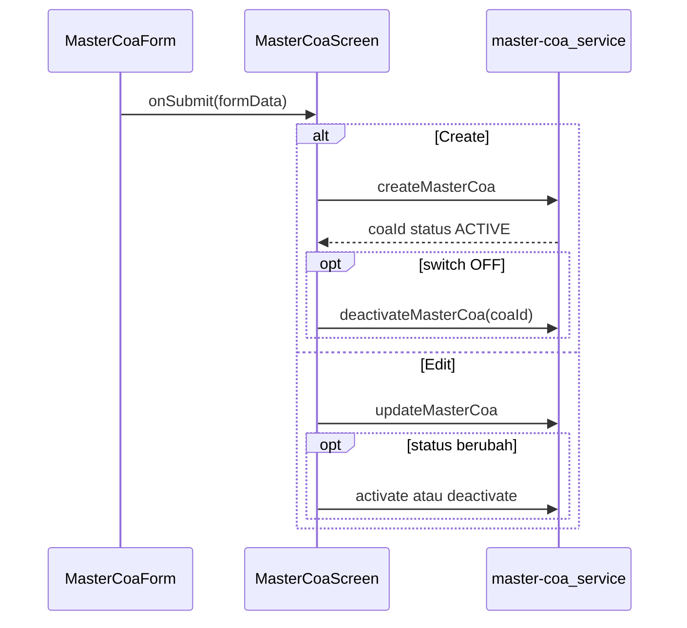

# Rencana: Perbaikan Form Tambah/Edit Master COA

## Konteks

| Aspek | Sebelum | Sasaran |
|--------|---------|---------|
| Jenis Transaksi | Manual loop dengan `fields.map()` (line 158-232) | `DataTable` dengan inline editing (pola [`DataTransaksiTab.tsx`](../../src/modules/fjb/components/tabs/DataTransaksiTab.tsx)) |
| Anggota | Checkbox statis (`BranchCheckboxGroup` + `BRANCH_OPTIONS`) | `SelectField` `mode="multi"` + `Controller` ✅ |
| Status | Hanya lewat aksi list/detail | `Switch` + `Controller` ✅ |

## Catatan API

Lihat [`master_coa.api.md`](./master_coa.api.md): `POST` / `PUT` tidak membawa field `status`; create default `ACTIVE`; perubahan status lewat `PATCH .../activate` dan `PATCH .../deactivate`.

Alur submit:



## Status Implementasi

| No | Fitur | Status | Keterangan |
|----|-------|--------|---------|
| 1 | SelectField multi untuk cabang | ✅ Selesai | Line 128-139 MasterCoaForm.tsx |
| 2 | Switch untuk status aktif | ✅ Selesai | Line 142-155 MasterCoaForm.tsx |
| 3 | statusActive di schema | ✅ Selesai | validationSchemas.ts |
| 4 | useQueryCabang hook | ✅ Selesai | hooks/useMasterCoa.ts |
| 5 | **Jenis Transaksi -> DataTable** | ❌ Belum | Masih manual loop |

## Perubahan yang Diperlukan

### Ubah Jenis Transaksi menjadi DataTable

**Lokasi:** `src/modules/master-coa/components/MasterCoaForm.tsx` - bagian "Jenis Transaksi" (line 158-232)

**Sebelum:**
- Menggunakan manual loop dengan `fields.map()` dan input fields
- Setiap transaksi ditampilkan dalam div dengan label "Transaksi #N"

**Sesudah:**
- Menggunakan `DataTable` dari `@/components/ui/table`
- Mirip dengan pola di `src/modules/fjb/components/tabs/DataTransaksiTab.tsx`

**Kolom tabel:**
1. No (nomor urut)
2. Nama Transaksi (InputField)
3. Kategori (SelectField)
4. Subgrup (InputField)
5. Grup (InputField)
6. Aksi (tombol Save/Edit + Hapus)

**Langkah implementasi:**

1. **Update imports di MasterCoaForm.tsx:**
```typescript
import { useFormContext, type Control, type UseFormSetValue } from 'react-hook-form';
import type { ColumnDef } from '@tanstack/react-table';
import { DataTable } from '@/components/ui/table';
import { CheckIcon, EditIcon, PlusIcon, TrashIcon } from 'lucide-react';
```

2. **Update validationSchemas.ts - tambah isSaved field:**
```typescript
transactions: z.array(
  z.object({
    transactionName: z.string().min(1, 'Nama transaksi wajib diisi'),
    category: z.enum(['TRX_IN', 'TRX_OUT'], { message: 'Kategori wajib dipilih' }),
    subgroup: z.string().min(1, 'Subgrup wajib diisi'),
    group: z.string().min(1, 'Grup wajib diisi'),
    isSaved: z.boolean().default(true),
  })
)
```

3. **Buat type dan column builders di MasterCoaForm.tsx:**

```typescript
type TransactionRow = {
  index: number;
  transactionName: string;
  category: 'TRX_IN' | 'TRX_OUT';
  subgroup: string;
  group: string;
  isSaved: boolean;
};

function buildTransactionColumns(
  watched: MasterCoaCreateFormData['transactions'],
  control: Control<MasterCoaCreateFormData>,
  setValue: UseFormSetValue<MasterCoaCreateFormData>,
  remove: (index: number) => void,
): ColumnDef<TransactionRow>[] {
  return [
    { id: 'no', header: 'No', cell: ({ row }) => row.original.index + 1 },
    {
      id: 'transactionName',
      header: 'Nama Transaksi',
      cell: ({ row }) => {
        const i = row.original.index;
        const isSaved = watched[i]?.isSaved ?? true;
        if (isSaved) return watched[i]?.transactionName || '-';
        return (
          <Controller
            name={`transactions.${i}.transactionName`}
            control={control}
            render={({ field }) => <InputField {...field} placeholder="Nama transaksi" />}
          />
        );
      },
    },
    {
      id: 'category',
      header: 'Kategori',
      cell: ({ row }) => {
        const i = row.original.index;
        const isSaved = watched[i]?.isSaved ?? true;
        if (isSaved) {
          const opt = COA_CATEGORY_OPTIONS.find(o => o.value === watched[i]?.category);
          return opt?.label || '-';
        }
        return (
          <Controller
            name={`transactions.${i}.category`}
            control={control}
            render={({ field }) => (
              <select {...field} className="...">
                {COA_CATEGORY_OPTIONS.map(opt => (
                  <option key={opt.value} value={opt.value}>{opt.label}</option>
                ))}
              </select>
            )}
          />
        );
      },
    },
    {
      id: 'subgroup',
      header: 'Subgrup',
      cell: ({ row }) => {
        const i = row.original.index;
        const isSaved = watched[i]?.isSaved ?? true;
        if (isSaved) return watched[i]?.subgroup || '-';
        return (
          <Controller
            name={`transactions.${i}.subgroup`}
            control={control}
            render={({ field }) => <InputField {...field} placeholder="Subgrup" />}
          />
        );
      },
    },
    {
      id: 'group',
      header: 'Grup',
      cell: ({ row }) => {
        const i = row.original.index;
        const isSaved = watched[i]?.isSaved ?? true;
        if (isSaved) return watched[i]?.group || '-';
        return (
          <Controller
            name={`transactions.${i}.group`}
            control={control}
            render={({ field }) => <InputField {...field} placeholder="Grup" />}
          />
        );
      },
    },
    {
      id: 'actions',
      header: 'Aksi',
      cell: ({ row }) => {
        const i = row.original.index;
        const isSaved = watched[i]?.isSaved ?? true;
        return (
          <div className="flex gap-1">
            <button
              type="button"
              onClick={() => setValue(`transactions.${i}.isSaved`, !isSaved)}
              className="p-1 hover:bg-muted rounded"
            >
              {isSaved ? <EditIcon className="size-4" /> : <CheckIcon className="size-4 text-green-600" />}
            </button>
            <button
              type="button"
              onClick={() => remove(i)}
              className="p-1 hover:bg-muted rounded text-destructive"
            >
              <TrashIcon className="size-4" />
            </button>
          </div>
        );
      },
    },
  ];
}
```

4. **Ganti rendering di return statement:**

```tsx
{!isEdit && (
  <div className="space-y-3">
    <div className="flex items-center justify-between">
      <h3 className="text-sm font-semibold">Jenis Transaksi</h3>
      <Button
        type="button"
        variant="outline"
        size="sm"
        onClick={() => append({ ...emptyTransaction, isSaved: false })}
      >
        <PlusIcon className="size-4" />
        Tambah
      </Button>
    </div>

    <DataTable
      columns={transactionColumns}
      data={transactionRows}
      serverSide={false}
      emptyStateMessage="Belum ada transaksi"
    />
  </div>
)}
```

**Referensi:** `src/modules/fjb/components/tabs/DataTransaksiTab.tsx`

## Ringkasan Perubahan

| No | File | Perubahan |
|----|------|-----------|
| 1 | `validationSchemas.ts` | Tambah `isSaved: z.boolean().default(true)` |
| 2 | `MasterCoaForm.tsx` | Ubah Jenis Transaksi manual → DataTable dengan inline editing |

## OpenSpec

Tugas terlacak di [`openspec/changes/add-master-coa/tasks.md`](../../openspec/changes/add-master-coa/tasks.md).